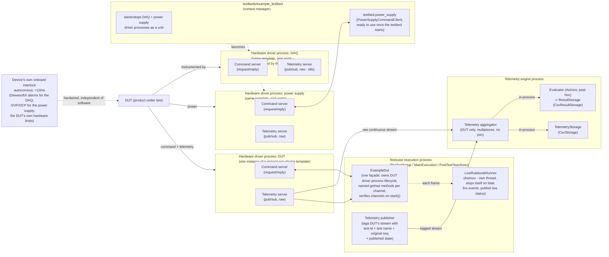

# Mytest — test engineering system architecture

## Purpose

This document describes the high-level architecture for a test engineering system: hardware device drivers, the physical testbeds and DUT (device under test) that tests run against, the test case lifecycle and its Rulebook-based evaluation framework, and the telemetry engine that aggregates, stores, and evaluates telemetry post-hoc. It is intended to give an implementing agent (or engineer) enough context to build individual components without needing the design conversation that produced it.

## System context

- Single test stand. One or more supporting hardware devices (a Dewesoft DAQ, a power supply), each with its own driver process, plus the DUT itself, which also has its own driver process and command/control channel - see Process architecture.
- Test cases are written in Python, each driving a test sequence through a three-phase lifecycle: PreTestSetup, MainExecution, PostTestTeardown.
- Deployment: on-prem test stand PC with network connectivity to office/cloud (not air-gapped).
- Safety requirement: some interlocks must trip in under 10ms. This is a hard real-time constraint that no process in this architecture can meet reliably (network hops, Python GC, OS scheduling all introduce unbounded jitter).

## Real-time tiers

Two distinct tiers, and they must not be conflated:

1. **Hard real-time (hardware tier).** Any interlock or abort that must trigger in under 10ms is implemented entirely on the device itself - for the DAQ, inside DewesoftX using its onboard Math, Alarm, and Digital-Out modules driving a hardwired relay/output to the DUT (e-stop, load release, etc.); other device types get their own onboard protection the same way (e.g. a power supply's own OVP/OCP circuitry, or the DUT's own hardware limits). Each device's hard-real-time protection runs autonomously on that device and does not depend on any process described below. This is the safety layer of record.
2. **Soft real-time (software tier).** Everything in this document — test sequencing, live limit checks, derived signal computation, evaluation, storage — operates in this tier. Acceptable latency here is roughly 10ms-1s depending on the check. Nothing in this tier should be relied on for safety-critical interlocks; it supervises and records, it doesn't replace the hardware interlock.

## Process architecture

One OS process per hardware device (including the DUT itself), plus the testcase execution process, plus the telemetry engine process - all communicating only through defined client/server and pub/sub interfaces (not shared memory, not direct imports). This is deliberate: it lets any one process be restarted, redeployed, or rewritten independently of the others, and lets evaluation logic be tested offline against captured telemetry. With one DAQ, one power supply, and one DUT, that's five processes today; adding another device adds a sixth, without touching anything else.

### 1. Hardware driver process (one instance per device)

This is a generic template, not device-specific code - the same command/telemetry server implementation (`hardware/command_server.py`, `hardware/telemetry_server.py`, `hardware/runner.py`) runs once per hardware device, each on its own ports, each the *only* process that talks to its device. No other process should open a second connection to the same device. Three device types exist today, each its own subfolder under `hardware/`:

- `hardware/mock_daq/` — `MockDaqBackend`: acquisition-style sine+noise channels (`chan_temp`, `chan_pressure`, `chan_vibration`).
- `hardware/mock_power_supply/` — `MockPowerSupplyBackend`: settable output (voltage/current) + enable flag, readback with noise.
- `hardware/mock_dut/` — `MockDutBackend`: the DUT itself. A simple first-order position/velocity/current servo approximation - command channels `position_input`/`position_gain`/`velocity_gain`/`velocity_integrator`, read channels `position`/`velocity`/`current`. Proves the generic framework fits a control loop, not just readbacks.

Each instance owns a `HardwareBackend` that requires only a universal core - `connect`, `disconnect`, `get_status`, `stream_samples`, `list_actions` - plus one generic `execute(action, **params)` for anything device-specific. The command/telemetry server code never needs to know what actions a given device supports, so adding a new device type never requires touching the server - only a new backend implementation under its own `hardware/mock_<device>/` folder (and, for caller convenience, a thin named-method wrapper on the client side, e.g. `hardware/mock_dut/mock_dut_command_client.py`'s `DutCommandClient`).

Exposes two interfaces:

- **Command server** — request/reply. Accepts commands from whoever needs to talk to that device (the testbed, the DUT abstraction, or a test case directly) and executes them against the device: the four universal actions (`connect`/`disconnect`/`get_status`/`list_actions`) go straight to the backend's core methods, everything else routes to `execute()` unchanged.
- **Telemetry server** — pub/sub. Streams the raw, decoded, timestamp-aligned live channel data at full rate. Does no evaluation or transformation beyond decode and timestamp alignment — it must stay fast enough that it never becomes the bottleneck. Channel names/values are an arbitrary dict, so this needs no changes at all across device types.

### 2. Testbeds — the physical fixture, not the DUT

`testbeds/<device_under_test>/` (e.g. `testbeds/example_testbed/`) defines the *supporting instrument* hardware a DUT's tests run against - today, one DAQ and one power supply. It deliberately does **not** start or command the DUT's own driver process - that's a distinct concern, owned instead by the DUT abstraction (below). `ExampleTestbed` is a context manager (`with ExampleTestbed() as testbed: ...`) that launches/tears down the DAQ and power supply driver processes as a unit, so test cases and demos don't each duplicate that subprocess-launching boilerplate. It also owns a ready-to-use, connected `PowerSupplyCommandClient` (`testbed.power_supply`) - instantiating and starting the testbed is the one thing a test case needs to get control of its supporting test hardware, rather than separately constructing its own power supply client alongside it.

### 3. The DUT abstraction — the product under test's own command and control

`testcases/<dut>/dut/` (e.g. `testcases/example_dut/dut/example_dut.py`'s `ExampleDut`) is the abstraction over the DUT's *own* hardware command and control channel - separate from the instruments the testbed manages. It owns the DUT driver process's lifecycle (start/stop, as a context manager) and is the *one* façade test-authored code touches for that DUT: every command/telemetry channel gets its own named `get_<channel>()`/`set_<channel>()` method (e.g. `set_position()`, `get_position()`, `get_velocity()`, `get_current()`), even where that's a thin forward to the underlying command/telemetry client - see Design principles. `get_channels()` returns a single, consistent snapshot of every read channel from one instant (via a telemetry subscription dedicated to synchronous point-reads, kept separate from the one handed to `LiveRulebookRunner`'s background thread, since a ZeroMQ socket isn't safe to read from two threads at once); the per-channel getters are thin wrappers over it. `start()` positively confirms the backend's declared channels actually exist - see Channel declaration below. A test case typically starts both the testbed (instruments) and the DUT (product) in PreTestSetup, and stops both in PostTestTeardown.

**Channel declaration** (`hardware/mock_<device>/mock_channels.py`): each backend declares its own `TELEMETRY_CHANNELS`/`COMMAND_CHANNELS` - the source of truth for what it actually streams/accepts, right next to the code that produces/accepts those exact strings (not a hand-maintained list elsewhere that could drift). `ExampleDut.start()` positively confirms both against the *live* driver process - `TelemetryClient.verify_channels()` blocks for one real frame and checks its keys; `CommandClient.verify_actions()` calls the backend's own `list_actions()` (a new addition to the universal core, dispatched the same way as `connect`/`disconnect`/`get_status`) and checks its answer - raising `MissingChannelError` immediately in `PreTestSetup` if either is missing, rather than a test discovering the gap later when some step happens to use the missing channel. `testcases/<dut>/channels.py` re-exports the same lists (not a second, independently-maintained copy) purely as a one-stop reference for test authors. Only wired up for the DUT today - DAQ and power supply have their own `mock_channels.py` declared, but nothing calls `verify_channels()`/`verify_actions()` against them yet, since no test case watches their telemetry (see Open implementation decisions).

### 4. Testcase execution process

`testcases/` holds both the reusable framework and the concrete, per-DUT test content:

- **Framework** (top level of `testcases/`): `base.py` (`TestCase`, the abstract three-phase lifecycle ABC), `telemetry_publisher.py` (`TelemetryPublisher`), `stopwatch.py` (`Stopwatch`, see below), and `asimov/` (the Rulebook evaluation framework, see next section).
- **Per-DUT content**: `testcases/<dut>/testcases/` (concrete `TestCase` subclasses), `testcases/<dut>/rulebooks/` (concrete `Rulebook`s), `testcases/<dut>/dut/` (the DUT abstraction).

Each test case is implemented as a three-phase lifecycle, not a generic state machine:

- **PreTestSetup** — start the testbed (instruments) and the DUT, power the DUT via the testbed's power supply, start the Telemetry Publisher pointed at whichever device's telemetry this test cares about (today: the DUT's own stream, via `TelemetryPublisher`'s `raw_endpoint` parameter - it's generic enough to tag *any* single device's raw stream, not hardcoded to the DAQ), and wire up a `LiveRulebookRunner` with this test's Rulebook(s). `BaseExampleDutTest` implements exactly this and nothing else - it's directly runnable, with a no-op `MainExecution`, proving the setup/teardown/tagging/evaluation-wiring plumbing works before any real test sequence exists. Concrete test cases subclass it (e.g. `CycleDutPositionTest`) and override `MainExecution` (and `TEST_NAME`/`RULEBOOKS`).
- **MainExecution** — the test's own sequence logic. `LiveRulebookRunner` owns telemetry consumption and Rulebook evaluation entirely on its own background thread (started/stopped by `BaseExampleDutTest`); a test step's own code (e.g. `CycleDutPositionTest`'s `cycle_position` step, in `testcases/example_dut/teststeps/teststeps.py`) is a plain elapsed-time loop that never touches a telemetry frame, a channels dict, or evaluation at all - it paces itself via `for _ in clock:` (`Stopwatch.__iter__`, see below), and only ever calls `dut.get_position()` (a synchronous point-read through `ExampleDut`'s façade, not a telemetry subscription) to closed-loop-check arrival. A non-fatal bound's violation is logged and the test continues. A fatal bound's violation stops `LiveRulebookRunner`'s own evaluation (it raises internally and its background thread exits) but does *not* stop MainExecution's own running code - see the open decision on whether that's sufficient. `CycleDutPositionTest` cycles the DUT's commanded position between two setpoints for a fixed duration: after commanding a target, it blocks (via `dut.get_position()`) until actually within `position_tolerance` of that target - not just after a fixed timeout - then holds there for `dwell_s` before flipping. The currently commanded setpoint is published as `position_target` state purely for visibility - no Bound references it today (see Asimov below and the open decision on dynamic-reference Bounds).
- **PostTestTeardown** — return the system to a state where another test can start (stop the DUT, disable/disconnect the power supply, stop the testbed, stop the telemetry publisher). Always runs, unconditionally, regardless of how PreTestSetup or MainExecution ended (normal completion, a fatal breach, a partway-through setup failure, or any other unexpected exception) - there's no "skip teardown" case. Because PreTestSetup sets up multiple devices sequentially, it can fail partway through, so PostTestTeardown must check what was actually set up before tearing it down. Each teardown action also runs independently of the others (a shared `_teardown_step()` helper logs a failure rather than raising), so one device's cleanup failing can't prevent another's, and can't mask whatever exception is already propagating out of PreTestSetup or MainExecution.

**Stopwatch** (`testcases/stopwatch.py`): a small wall-clock elapsed-time helper (`start()`/`elapsed_s()`/`expired`) so a test's own sequencing logic (how long has this test run, how long since the last state change) reads in plain seconds instead of doing arithmetic on raw telemetry frame timestamps. Also directly iterable (`__iter__`, paced by its own `wait()`/`POLL_INTERVAL_S`), so `for _ in stopwatch:` is a fully self-pacing wait loop - no `.expired` check or sleep call for a test step to remember. Deliberately *not* used for a Rulebook's `persistence_s` debounce timing, which stays tied to the data's own timestamp (`frame.t`) rather than wall-clock time — see Asimov below. On a single test stand this is one shared system clock either way; the distinction matters if hardware driver and testcase execution processes ever run on different machines, where `frame.t` (stamped by whichever process owns the device) is the one value that's actually shared across the pipeline (raw stream, tagged stream, storage, evaluation) and safe to correlate on - a `Stopwatch` reading in the test case's own process is not persisted anywhere and never needs to be.

**Client-side components**, used across the phases above - a test case that needs more than one device holds one HW command client and one telemetry client per device, each just pointed at a different device's endpoints, per the generic wire protocol:

- **HW command client** — talks to a hardware driver's command server (its universal core - `connect`/`disconnect`/`get_status`/`list_actions` - plus whatever device-specific actions that device supports via `execute()`); the generic `CommandClient` lives in `hardware/clients/`, but named convenience wrappers (e.g. `DutCommandClient`) live alongside each device's own backend in `hardware/mock_<device>/mock_<device>_command_client.py`, not in `hardware/clients/` - only the truly device-agnostic client code lives there.
- **Telemetry client** — subscribes to a hardware driver's telemetry server. Test steps never hold one directly today (see MainExecution above) - `ExampleDut` owns two: one handed to `LiveRulebookRunner`'s background thread for continuous evaluation, and a separate dedicated one for `get_channels()`'s synchronous point-reads, kept apart since a ZeroMQ socket isn't safe to read from two threads at once.
- **Telemetry publisher** — runs as a background thread (started in PreTestSetup, stopped in PostTestTeardown) with its own separate subscription to a device's raw telemetry stream, so it never contends with the test case's own telemetry client for the same socket. Republishes each frame tagged with test-case context - `test_id` (random per run), `test_name` (stable per test *type*, since Rulebook matching needs a stable identifier), and the original frame's sequence number carried over unchanged - plus any state the test case has published via `set_state(name, value)` (e.g. `monitoring_active`, `test_status`, `{bound_label}_status`), merged into the same `channels` dict as real hardware channels. The publisher itself is private to the base test case (e.g. `BaseExampleDutTest._publisher`); everything else, including the `@step` decorator and step bodies, calls `test.set_state(...)` (forwarding to the publisher) rather than touching the publisher object directly.

### Asimov — the Rulebook evaluation framework (`testcases/asimov/`)

Named for Asimov's Three Laws of Robotics - the classic "rules governing robot behavior" reference. Holds the shape test authors use to define channel checks, and the shared logic that evaluates them over time:

- **`Bound`** (`rulebook.py`) — one channel check: `channel`, up to three optional constraints - `upper`, `lower`, `expected` - ANDed together (violated if the channel is above `upper`, below `lower`, or not exactly `expected`; any combination may be set), an optional `gate_channel`/`gate_value` (only evaluated when another channel - hardware or test-case-published state - has a specific value), an optional `persistence_s` (debounce: the raw condition must hold continuously for this many seconds before the bound is considered violated), and `fatal`/`event_name`, which only matter to a *live* evaluator (post-hoc evaluation ignores them, since it has no live test to abort or hardware event to fire). `Bound.evaluate(channels)` is a pure, stateless, instantaneous check - `None` if the bound doesn't apply this frame (gate not met, channel absent), else `True`/`False`. All three constraints compare only against fixed values today - see the open decision on comparing a channel against another live channel's value.
- **`Rulebook`** — a named collection of `Bound`s for one test type (`Rulebook.test_name`, matched against `TestCase.TEST_NAME`). Multiple Rulebooks can be registered for the same `test_name`.
- **`RulebookEvaluator`** — tracks per-bound violated/cleared state (and, when `persistence_s` is set, the debounce timer) across repeated `evaluate(channels, t)` calls against one ongoing stream of channel snapshots, emitting a `BoundTransition` only when a bound's state actually changes (not a firehose of one row per frame). Debounce is asymmetric and non-cumulative by design: **clearing is immediate** regardless of `persistence_s`, and **any gap resets the "how long has this been violated" clock to zero** - it doesn't pause and resume. This is the one piece of shared logic used *both* ways:
  - **Live**, via `LiveRulebookRunner` (`live_rulebook_runner.py`) - a test case constructs one with its own Rulebook(s) and a `TelemetryPublisher`, then `start()`s it against a telemetry client; it runs its own background thread, and on each frame's `evaluate(channels)` call it publishes a per-bound live status channel (`f"{bound_label}_status"`, `"PASS"`/`"FAIL"`) and a recomputed aggregate `test_status`, fires `trigger_event` for any transition with an `event_name`, and raises `FatalBoundViolation` on a fatal breach - which stops this runner's own background thread (see `_run()`), not MainExecution's own thread (see the open decision on whether that's sufficient). This is the *only* place a bound violation can affect the running test at all today - per the "no feedback loop" principle.
  - **Post-hoc**, via `telemetry_engine.evaluation.Evaluator` - a thin per-`test_id` multiplexer that creates a fresh `RulebookEvaluator` the first time it sees a given `test_id` (registering every Rulebook matching that frame's `test_name`), and wraps each `BoundTransition` into a `ViolationEvent` (adding `test_id`/`test_name`/`seq`/`t`) for storage. Can never influence a running or already-finished test.

### 5. Telemetry engine process

`telemetry_engine/` — aggregator, storage, and evaluation are sub-components of this one process, not separate OS processes; they communicate in-process, not over another wire hop.

- **Telemetry aggregator** (`aggregator.py`) subscribes to both inbound streams - the raw continuous stream sent directly from a hardware driver's telemetry server (independent of whether a test case is running), and the tagged stream from the testcase execution process's telemetry publisher - and multiplexes them into a single in-process feed (an async generator) for storage/evaluation to consume. It does not correlate or join raw and tagged frames by sequence number: a tagged frame necessarily arrives after its raw counterpart (driver → publisher → aggregator is one more hop than driver → aggregator directly), so joining them would require buffering raw frames against a timeout - real design work left to evaluation, which is better positioned to decide how to join, if ever needed. The aggregator itself stays a dumb multiplexer, same spirit as the telemetry server staying "fast and dumb on purpose." Its raw/tagged endpoints are constructor parameters (defaulting to the DAQ's), so it can point at whichever single device a given test's Telemetry Publisher is tagging - today that's the DUT, for `CycleDutPositionTest`.
- **Storage** (`storage.py`/`csv_storage.py`, `result_storage.py`/`csv_result_storage.py`) — two parallel, minimal interfaces (`TelemetryStorage`, `ResultStorage`), each with only `write()`/`close()`, mirroring `HardwareBackend`'s pattern: the rest of the system depends only on the interface, never a concrete store, so a real time-series database and a real report/relational store can replace today's CSV implementations later without touching the aggregator, the evaluator, or `main.py`. Kept as two separate interfaces (not one) because the architecture doc's own distinction holds: raw/derived time-series data and pass/fail summaries are persisted differently. `write()` on the telemetry side decomposes one merged item into one point per channel (`seq, t, test_id, channel, value`) - the same shape a real TSDB write takes. `CsvStorage`/`CsvResultStorage` are the only implementations today: one timestamped local CSV file per process run each, in long/tidy format, never appended across restarts.
- **Evaluation** (`evaluation.py`) — see Asimov above; `Evaluator` here is the post-hoc half of the shared `RulebookEvaluator` logic. `main.py`'s `REGISTERED_RULEBOOKS` is a manual list for now - as new DUTs and their test cases/Rulebooks are added under `testcases/`, add their Rulebook there too.

This whole process is a **terminal sink** — there is intentionally no feedback path back to the testcase execution process. Implications:

- Results here are for reporting, dashboards, and offline analysis, not for real-time test sequencing decisions.
- Any check that needs to influence the live test sequence (e.g., "abort if channel X exceeds Y") must be implemented inside the testcase execution process (via `LiveRulebookRunner`, using the test case's own telemetry client), not by waiting on a result from this process.

## Data flow summary

Shown below: today's fully-wired path for `CycleDutPositionTest` - the DUT's hardware driver instance, tagged by the Telemetry Publisher, merged and evaluated in the telemetry engine. The DAQ and power supply driver instances are started by the testbed (for powering the DUT and for future use), but their own telemetry isn't watched or tagged by this test case - see Open implementation decisions.

## Design principles

- **Single owner of hardware.** Exactly one process talks to a given device. Everything else goes through its command/telemetry interfaces. Adding a device means adding a process, never adding a second connection into an existing one.
- **Testbed vs. DUT are separate concerns.** The physical fixture/instrument setup (`testbeds/`) is managed independently from the product being tested (the DUT abstraction under `testcases/<dut>/dut/`) - a testbed never issues DUT commands, and the DUT abstraction never manages instrument processes.
- **Single source of truth for channel checks.** A `Bound`'s definition (value, comparison, fatal/event_name, persistence) is written once, in a `Rulebook`, and used both for live in-test control (`LiveRulebookRunner`) and post-hoc reporting (`telemetry_engine.evaluation.Evaluator`) - not duplicated as two independently-maintained threshold definitions.
- **Shared evaluation logic, not duplicated bookkeeping.** `RulebookEvaluator`'s transition-tracking (and debounce) logic is written once, in `testcases/asimov/rulebook.py`, and reused by both the live and post-hoc paths - only who calls it, how many instances exist, and what they do with the result differs.
- **Debounce is asymmetric and intentional.** `persistence_s` only delays a bound *becoming* violated; clearing is always immediate, and any interruption resets the debounce clock rather than accumulating - matching how a real alarm/limit-check debounce is expected to behave.
- **Test sequencing timing is decoupled from telemetry data timestamps.** A test's own control flow (`Stopwatch`) uses wall-clock time in its own process; a Rulebook's `persistence_s` uses the data's own timestamp (`frame.t`) - these serve different purposes and are not interchangeable.
- **Separation of raw ingest from evaluation.** The telemetry server/publisher path never does evaluation logic; that's isolated to the telemetry engine so it can change independently.
- **Dual telemetry path for resilience.** Raw data reaches the aggregator directly from the hardware driver, so a bug or crash in the testcase execution process doesn't cause data loss — only the loss of test-case tagging/context for that window.
- **Hard real-time stays in hardware.** No software process in this architecture is on the safety-critical path.
- **No feedback loop from the telemetry engine to command.** Keeps it a simple downstream consumer; live decision-making logic lives entirely in the testcase execution process.
- **One façade per DUT.** `ExampleDut` (and any future DUT abstraction) is the single object test-authored code touches for that DUT - every command/telemetry channel gets its own named `get_<channel>()`/`set_<channel>()` method, even where that's a thin forward to the underlying command/telemetry client. Test steps never reach into `.command`/`.telemetry` directly, and never touch a telemetry frame, a channels dict, or evaluation at all - see MainExecution above.
- **Positively confirm channels exist, don't assume.** Each backend declares its own `TELEMETRY_CHANNELS`/`COMMAND_CHANNELS` (`hardware/mock_<device>/mock_channels.py`), and the DUT abstraction checks them against the *live* driver process at `start()` (`verify_channels()`/`verify_actions()`, raising `MissingChannelError`), rather than trusting a hand-maintained list that could silently drift from what the backend actually implements.

## Resolved implementation decisions

- Wire protocol for command server/client: ZeroMQ REQ/REP. Wire protocol for telemetry server/client and telemetry publisher/aggregator: ZeroMQ PUB/SUB. The aggregator → storage/evaluation hop is not a wire protocol at all - they're sub-components of one process, connected in-process.
- Test case lifecycle: a custom three-phase model (PreTestSetup/MainExecution/PostTestTeardown), split into a reusable base case (`BaseExampleDutTest`, no test logic) and concrete subclasses (`CycleDutPositionTest`) - not a generic state machine or literal pytest test discovery.
- Hardware backend interface: a small universal core (`connect`/`disconnect`/`get_status`/`stream_samples`/`list_actions`) plus one generic `execute(action, **params)` for anything device-specific. Proven against three unrelated device types (DAQ, power supply, DUT - the last being a control loop, not just a readback) with zero changes to the command/telemetry server code. `list_actions()` was added later, alongside channel declaration below, so a client can positively confirm a backend's real command surface instead of trusting a static list.
- Testbed vs. DUT separation: `testbeds/<device_under_test>/` owns instrument processes (DAQ, power supply) only, including a ready-to-use command client for each (e.g. `testbed.power_supply`); `testcases/<dut>/dut/` owns the DUT's own driver process and command/control channel. Neither manages the other.
- Multi-device command control and defensive teardown: PreTestSetup/PostTestTeardown hold one client per device and set them up/tear them down independently; PostTestTeardown always runs unconditionally, and its individual steps run independently via `_teardown_step()`, which logs rather than raises.
- Storage interfaces: `TelemetryStorage` and `ResultStorage`, each `write()`/`close()` only, with CSV as the interim implementation for both.
- Rulebook framework (Asimov): `Bound`/`Rulebook`/`RulebookEvaluator`/`BoundTransition` in `testcases/asimov/`, with `fatal`/`event_name`/`persistence_s` unifying what used to be two separate, duplicated threshold-definition mechanisms (a live-only `ChannelLimit` and a post-hoc-only `Bound`) into one. `LiveRulebookRunner` extracted separately as the live-side wiring (publish status, log, fire events, decide fatal), since that plumbing is identical for any test case using a Rulebook. A `Bound` checks one channel against up to three fixed-value constraints - `upper`/`lower`/`expected` - ANDed together; comparing against another *live* channel's value was tried (`Comparison.DEVIATES`) and deliberately dropped as premature generality with only one consumer (see open decisions). The one concrete case that needed it (`CycleDutPositionTest` checking position against a moving commanded target) now closed-loops in the test step itself instead, via `ExampleDut.get_position()` - see MainExecution above.
- Debounce (`persistence_s`): asymmetric (instant clear, delayed violate) and non-cumulative (any gap resets the clock) - deliberately, not a bug.
- Test sequencing timing: `Stopwatch` (plain wall-clock elapsed time, also directly iterable for self-pacing wait loops) for a test's own control flow, kept separate from `frame.t` (used only for Rulebook `persistence_s` debounce, which must stay tied to the data's own timestamp).
- Channel declaration and verification: each backend declares its own `TELEMETRY_CHANNELS`/`COMMAND_CHANNELS` (`hardware/mock_<device>/mock_channels.py`), and the DUT abstraction (`ExampleDut.start()`) positively confirms both against the live driver process (`TelemetryClient.verify_channels()`, `CommandClient.verify_actions()`), raising `MissingChannelError` immediately rather than a test discovering a gap later. Resolved and implemented for the DUT only so far - see Open implementation decisions for extending it to the DAQ/power supply.
- DUT abstraction shape: one façade (`ExampleDut`) with a named `get_<channel>()`/`set_<channel>()` method per command/telemetry channel, even where that's a thin forward to the underlying client - not a class that re-exposes its command/telemetry clients for callers to reach into directly.

## Open implementation decisions (not yet finalized)

- Which real time-series database eventually implements `TelemetryStorage` in place of `CsvStorage` (candidates: InfluxDB, TimescaleDB), and the separate report/relational store choice for `ResultStorage`.
- Whether the DAQ's hardware driver instance specifically should run as a Windows service (likely required, since DewesoftX control is Windows-only) - other device instances aren't tied to that constraint.
- Whether/how evaluation correlates raw and tagged frames by sequence number, if ever needed.
- Whether/how MainExecution polls more than one device's telemetry concurrently. Today it only watches whichever single device's telemetry client it's given (the DUT's, for `CycleDutPositionTest`) - the current MainExecution loop is a single blocking subscription, not a poller across multiple sockets, so e.g. the DAQ's or power supply's own telemetry isn't watched by any test case even though their driver processes are running.
- Whether/how the telemetry publisher and telemetry aggregator generalize to merging *multiple* devices' raw streams simultaneously within one test. Today each is generic enough to point at any single device's endpoints (proven by pointing both at the DUT instead of the DAQ), but there's no mechanism to tag/merge more than one device's telemetry into a single test run's tagged stream at once.
- Multi-machine deployment and clock synchronization: today everything runs on one test stand PC, so all processes share one system clock. If the hardware driver(s) ever run on a separate machine from the testcase execution/telemetry engine processes, `frame.t` (the one timestamp shared across the whole pipeline) would need real clock synchronization (e.g. NTP) between machines - not yet a concern, but worth remembering before any multi-machine deployment.
- Extending channel declaration/verification (see Resolved implementation decisions) to the DAQ and power supply. Both already have their own `mock_channels.py` with `TELEMETRY_CHANNELS`/`COMMAND_CHANNELS` declared, but nothing calls `verify_channels()`/`verify_actions()` against them yet, since no test case watches their telemetry today (see the MainExecution polling item above) - the mechanism is generic and proven against the DUT, so this is a one-line addition whenever a test case actually needs it, not a redesign.
- Whether/how a Bound can ever check a channel against another *live* channel's value (a dynamic reference), rather than only a fixed number. `Bound.Comparison.DEVIATES` was tried for exactly this (tracking a commanded setpoint) and deliberately removed - it was the only consumer of the capability in the whole codebase, so keeping it was speculative generality rather than a proven need. The one concrete case that needed it now closed-loops in the test step itself instead (`ExampleDut.get_position()`, polled directly from `cycle_position`) rather than via a Bound - revisit a Bound-level mechanism only if a case emerges that a step-level check can't handle (e.g. a post-hoc Rulebook needing the same comparison, since post-hoc evaluation has no equivalent to a step's live polling).
- **Whether a fatal bound violation actually needs to stop MainExecution's own running code, and if so, how.** Today, `LiveRulebookRunner.evaluate()` raises `FatalBoundViolation` the instant a fatal bound violates, but this is deliberately *not* propagated into MainExecution's thread - it only stops the runner's own background evaluation thread (see `LiveRulebookRunner._run()`). MainExecution/a step's own control flow (e.g. `cycle_position`'s loop) is completely unaffected and keeps running - and keeps commanding hardware - for its full remaining duration, unaware evaluation has stopped. This was a deliberate choice among a real trilemma: Python has no safe way to force an *already-running, different* thread to stop (the unsafe options - async exception injection into the thread, or OS signals - were both rejected; signals in particular don't even work reliably here, since tests aren't guaranteed to run on the main thread, e.g. `demo_evaluation_run.py`'s `asyncio.to_thread`). A cooperative checkpoint approach (a `wait()`-style call test-sequencing code would call instead of `time.sleep()`) was prototyped and works, but was rejected in favor of keeping test-authored step code fully free of any fatal-bound awareness. **This needs real testing and further inspection before being relied on as an actual safety mechanism** - in particular, the concern that a hardware-safing action taken at evaluation time (if one is ever added) could be immediately undone by MainExecution's own still-running, now-stale command logic reverting the system right back to the condition that was being safed against. Remember: none of this is the safety layer of record regardless - that's the hardware's own onboard interlock (see Real-time tiers above), which this entire mechanism supervises but never replaces.
